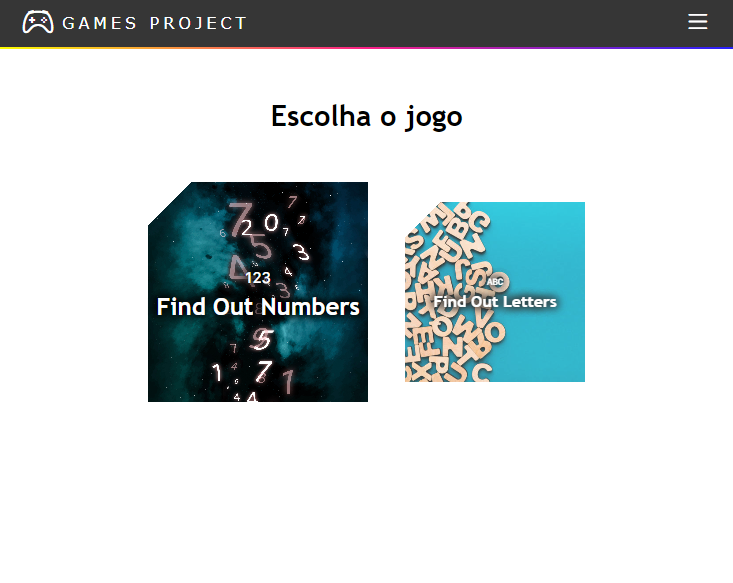
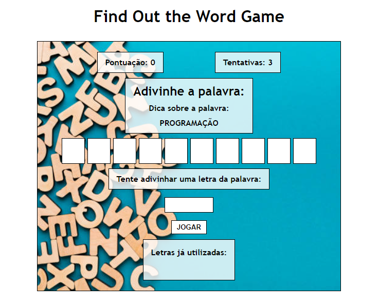
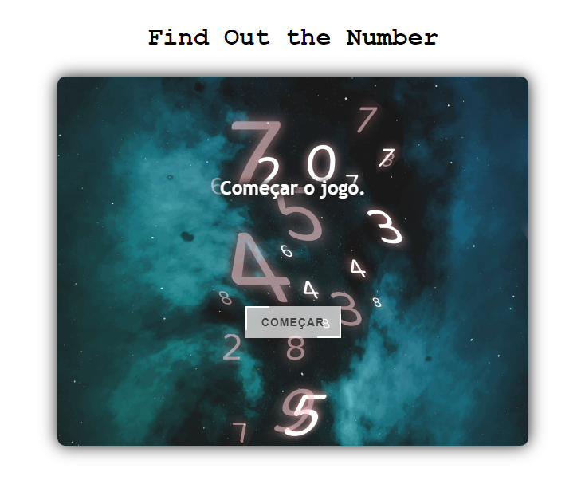

# Project Games with React and JavaScript

This is a simple web application built with React and JavaScript. It allows users to choose a game and play.

## Features

- Navbar interactive
- Choose and play a game
- Responsive design

## Technologies Used

- React
- JavaScript
- CSS (for styling)

## Contributing

Contributions are welcome! If you find any issues or have suggestions for improvement, please create an issue or submit a pull request.